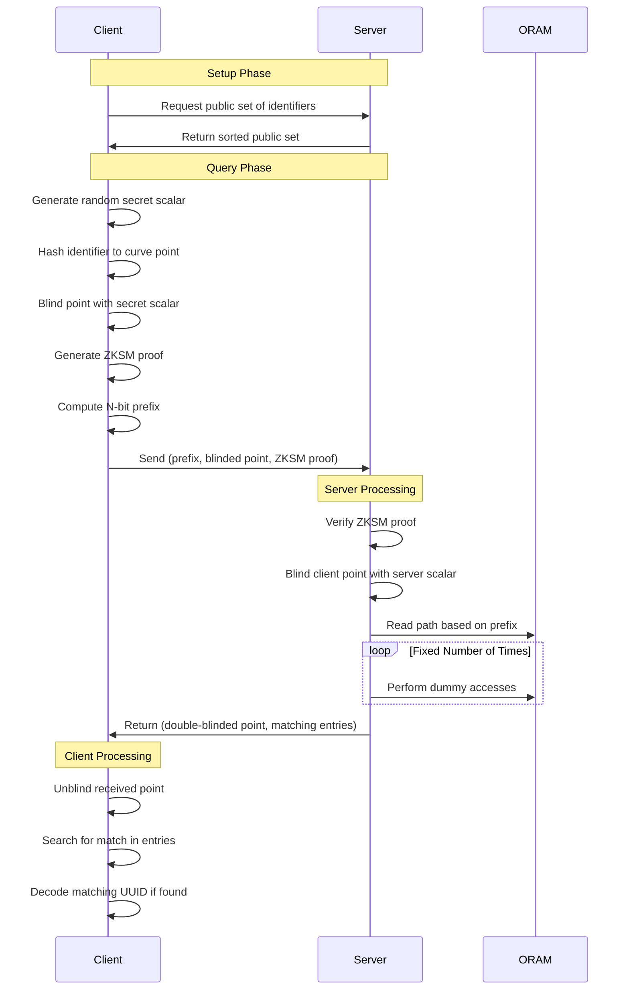

# RUMI

A privacy-preserving discovery service design for mapping distinct identifiers to IDs without revealing any information to the server!

## Protocol Flow

The privacy guarantees are:

1. Server learns nothing about:

* Which identifier is being queried
* Whether a query resulted in a match
* Access patterns of queries
* The actual identifier-to-ID mappings (they're stored in blinded form)

2. Client learns nothing about:

* Other identifiers in the system
* Other user IDs in the system
* Size of the database (due to fixed access patterns)

3. Network observer learns nothing about:

* Query contents (due to blinding)
* Whether queries succeeded (due to fixed-size responses)
* Database contents or size

## Demo

To start the server, run `cargo run --bin server` in one terminal. The server will start with 100 demo identifiers (1000000000 through 1000000099). Run `cargo run --bin client lookup 1000000042` in another terminal to start the client and lookup for a valid identifier. Run `cargo run --bin client lookup 9999999999` to lookup a invalid identifier.

## How it works?

Cryptography used :

1. Elliptic Curve Cryptography (ECC): Used for secure double-side blinding (SMPC) operations and point encoding. Uses P256 for curve operations.
2. Path ORAM (Oblivious RAM): Implemented to obscure access patterns and enhance privacy.
3. Zero-Knowledge Set Membership (ZKSM) Proofs: Ensures that clients can prove they're querying valid identifiers without revealing which ones.

*Client generates blinded requests, server manages the ORAM structure and processes client requests without learning the actual identifiers.*

The client has a list of identifiers corresponding to their IDs. Both client and server have their own secret keys. The client stores its data in an Path ORAM as a privacy layer. The server wants to look up a ID for specific identifier, so it blinds the identifier using its secret key and also creates a proof to show that its asking for a valid identifier without revealing which one. The client recieves the blinded identifier and proof and ensures the request is valid. It further blinds the identifier with its own secret key, then searches ORAM for matching data and sends the double-blinded data with set of potential matches. The server removes its blinding, and searches for client blinded identifier in set of matches.

1. Client Preparation:
   * Client generates a random secret scalar for blinding operations.
   * Client receives the public set of identifiers from the server.

2. Client Request Generation:
   * Client hashes the identifier to a point on the elliptic curve.
   * Client blinds this point using their secret scalar (client-blinded identifier point).
   * Client generates a ZKSM proof to prove the identifier is in the public set without revealing which one.
   * Client computes the N-bit prefix of the hashed identifier.

3. Client Request Transmission:
   * Client sends to the Server:
     a) The N-bit prefix of the hashed identifier
     b) The client-blinded identifier point
     c) The ZKSM proof

4. Server Processing:
   * Server verifies the ZKSM proof to ensure the identifier is in the public set.
   * If verification fails, the server rejects the request.
   * If verification succeeds, the server proceeds with the following steps:
     a) Server blinds the client-blinded identifier point with its own secret scalar, creating a double-blinded identifier point.
     b) Server uses the N-bit prefix to locate the corresponding ORAM path.
     c) Server reads the ORAM path, retrieving all blocks along this path.
     d) Server performs a fixed number of additional random ORAM accesses to obscure the actual number of matches.

5. Server Response:
   * Server returns to the client:
     a) The double-blinded identifier point
     b) A map of server-blinded identifier points to corresponding blinded user ID points from the retrieved ORAM blocks

6. Client Processing:
   * Client unblinds the double-blinded identifier point using the inverse of their secret scalar.
   * Client searches for the unblinded point in the returned map.
   * If a match is found, the client retrieves the corresponding blinded user ID point.
   * Client unblinds the user ID point using the inverse of the hashed identifier scalar.

7. Final Result:
   * If a match was found and successfully unblinded, the client now has the unblinded user ID point.
   * This point can be decoded to retrieve the actual UUID.

8. ORAM Updates:
   * After each access, the server updates the ORAM structure:

     a) Generates a new random path for the accessed block.
     b) Writes back all retrieved blocks along this new path.   
     c) Updates its position map to reflect the new location of the block.

The benefit of this approach is that the server only learns about the association between the identifiers when the client explicitly requests it, and even then, the server doesn't learn which specific identifier was requested. The ORAM structure and fixed-size operations obscure access patterns, while the blinding process ensures that the identifiers are obscured before transmission to the server. The ZKSM proof adds an extra layer of security by proving set membership without revealing the specific element.

This enhances the privacy and confidentiality of the client's data and prevents the server from having unrestricted access to sensitive information. The client can only refer to an identifier when they know it, preventing offline guessing attacks. While the server retains some information (N-bit prefixes and blinded points), it cannot directly link this data to the original identifiers without the client's secret key.

### References

I was inspired by [How Signal uses ORAMs](https://signal.org/blog/building-faster-oram/)!

The best blog to learn ECC that I could find out was [this](https://andrea.corbellini.name/2015/05/17/elliptic-curve-cryptography-a-gentle-introduction/)! The idea of Zero Knowledge Set Membership comes from [this](https://eprint.iacr.org/2021/1672.pdf) paper paired with the simple Path ORAM coming from [this](https://eprint.iacr.org/2013/280.pdf) paper.

### Path forward

1. Add support for Private Information Retrieval (PIR) to further reduce server knowledge. Think about IT-PIR (if distributed servers are involved), cPIR (using Homomorphic encryptions but huge computational overhead). Try tinkering with Hybrid PIR-ORAM scheme referenced in [this](https://arxiv.org/pdf/1904.05452) paper. Use of PIR has significant performance tradeoffs!
2. Tinker with a Cuckoo hashing scheme proposed by [this](https://eprint.iacr.org/2020/997.pdf) paper to improve efficiency and reduce the need for large buckets and store blocks more efficiently in the Simple Path ORAM! Though not sure about its security bottlenecks!
3. Implement a secure update mechanism using ZKPs.
4. Goals:
   - Write: <15μs (17% improvement)
   - Read:  <50μs (50% improvement)
5. Tackle side channel attacks!

## Analysis 

Run `sudo -E cargo flamegraph --root --bin server` and then lookup any identifier. Then close the server to get the flamegraph in the root of the project. 

The benchmark results were :

oram_write: [17.631 µs 17.893 µs 18.167 µs]
           |_min___|_avg___|_max___|

oram_read:  [100.96 µs 101.34 µs 101.73 µs]
           |__min___|__avg___|__max___|

The read is significantly slower than writes :(

Run `cargo bench` for detailed benchmarks.

Run `RUST_LOG=debug cargo run --bin server` and `RUST_LOG=debug cargo run --bin client -- lookup 1000000001` to run the debug traces.

Also, `tokio-console` can be used for more performance monitoring.

## Disclaimer

This is a personal project to deepen the understanding of Cryptography after undertaking the course [CS670](https://www.cse.iitk.ac.in/pages/CS670.html) from IIT Kanpur. 

Not designed to be used in production!