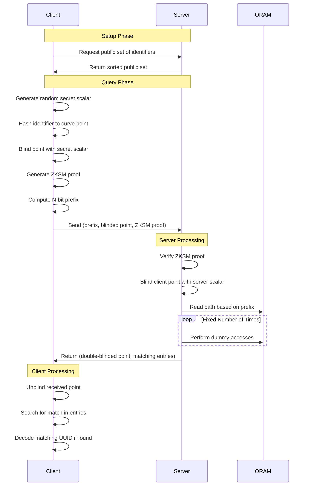

# RUMI

A privacy-preserving discovery service design for mapping distinct identifiers to IDs without revealing any information to the server!

## Why? Whats the use?

Imagine you download a typical messaging app. To find your friends, it usually asks for access to your entire contact list. You grant it permission (because you want to find your friends!), and the app uploads all your contacts' phone numbers (or sometimes even more data) to its servers. Here's why this is problematic:

* Privacy Loss: The app now has a copy of all your contacts, even those who aren't using the app. This is a huge privacy risk. The app company could use this data for advertising, sell it to third parties, or it could be compromised in a data breach.

* Lack of Control: You have little control over what happens to your contacts' data once it's on the app's servers.

* Potential for Abuse: Even if the app company is well-intentioned, the data could be misused. Imagine a rogue employee accessing your contact list, or a government demanding access to the data.

The motivating solution - Imagine a new messaging app. Users want to find their existing contacts who are also on the app, without revealing their entire contact list to the service. Basically sort of a [Private Set Intersection](https://en.wikipedia.org/wiki/Private_set_intersection)!

The phone number is the public identifier, while the UUID is private to the app. The user's contact list is private and remains on the phone. The app only processes individual contacts from this list one at a time, locally, preventing the server from ever seeing the complete list.

This system allows the client to check for matches in the server's database without the server ever learning the client's contact list or the UUIDs of those contacts. The client only learns the UUIDs of contacts that are present in the server's database, and only if the client already knows the corresponding phone number. This achieves the desired privacy-preserving contact discovery.

Why not just hash the entire contact list and send it to the server?

> This is what many apps used to do (and some still do). It's incredibly insecure. The server gets a complete list of hashed phone numbers, which can be attacked using rainbow tables or brute-force methods.

Why not just send the hashed phone number to the server for each lookup?

> This is better than sending the whole list, but it still leaks information. The server can build a profile of which phone numbers a user is interested in.

## Demo

First set `UUID=$(uuidgen)` to create a random UUID.

Then, to start the server, run `cargo run --bin server` in one terminal.
The server will start with 100 demo identifiers (1000000000 through 1000000099).
Register the identifier you want to lookup later using `cargo run --bin client register 1000000042 $UUID` Run `cargo run --bin client lookup 1000000042` in another terminal to start the client and lookup for a valid identifier. Run `cargo run --bin client lookup 9999999999` to lookup a invalid identifier.

## Protocol Flow



The privacy guarantees are:

1. Server learns nothing about:

* Which identifier is being queried
* Whether a query resulted in a match
* Access patterns of queries
* The actual identifier-to-ID mappings (they're stored in blinded form)

2. Client learns nothing about:

* Other identifiers in the system
* Other user IDs in the system
* Size of the database (due to fixed access patterns)

3. Network observer learns nothing about:

* Query contents (due to blinding)
* Whether queries succeeded (due to fixed-size responses)
* Database contents or size

## How it works?

Cryptography used :

1. Elliptic Curve Cryptography (ECC): Used for secure double-side blinding (SMPC) operations and point encoding. Uses P256 for curve operations.
2. Path ORAM (Oblivious RAM): Implemented to obscure access patterns and enhance privacy.
3. Zero-Knowledge Set Membership (ZKSM) Proofs: Ensures that clients can prove they're querying valid identifiers without revealing which ones.

User Story :

As Alice, a new user of the "SecureChat" messaging app, I want to see which of my phone contacts are also using SecureChat, so that I can easily connect and chat with them within the app, without revealing my entire contact list or any individual contact's phone number to the SecureChat server.

Scenario: Alice Connects and Finds Bob

Pre-requisite: Bob Registers with SecureChat (This Happens Before Alice's Lookup)

Bob's Phone (Client-Side):
* Generates a random secret key - `bob_secret_key` (a scalar).
* Hashes his phone number - `hashed_bob_number`.
* Converts the hashed phone number to an elliptic curve point: `bob_phone_point`
* Blinds the point: `blinded_bob_number` = `bob_phone_point` * `bob_secret_key`.
* Generates a UUID for himself within SecureChat- `UUID_BOB`.
* Encodes the UUID to a point on curve - `encoded_uuid_bob`
* Generates a ZKSM proof `zksm_proof_bob` to prove that `hashed_bob_number` is in the set of all registered, hashed phone numbers. Remember, the "public set" (let's call it S) is the conceptual set of all hashed phone numbers of users who have registered with SecureChat. It's not a literal list sent to the client, but it represents the information that could be derived from the server's database.
`S = {hash(phone_1), hash(phone_2), hash(phone_3), ...}` where `phone_1`, `phone_2`, etc., are the phone numbers of all registered users.
* Calculates the N-bit prefix of the hashed phone number: `prefix_bob`.
* Sends `blinded_bob_number`, `encoded_uuid_bob`, `zksm_proof_bob`, and `prefix_bob` to the server.

SecureChat Server:
* Receives `blinded_bob_number`, `encoded_uuid_bob`, `zksm_proof_bob`, and `prefix_bob`.
* Verifies `zksm_proof_bob`. If invalid, rejects the registration.
* Generates a random secret key - `server_secret_key` (a scalar).
* Double-blinds Bob's number - `double_blinded_bob_number` = `blinded_bob_number` * `server_secret_key`.
* Blinds Bob's UUID - `blinded_uuid_bob`
* Stores (`double_blinded_bob_number`, `blinded_uuid_bob`) in the ORAM, using `prefix_bob` to determine the initial bucket.

Alice's Contact Discovery (After Bob's Registration)
Alice's Phone (Client-Side):

* Alice installs SecureChat and grants access to her contacts.
* Alice's phone generates a random secret key - `alice_secret_key` (a scalar).
* Alice wants to find Bob. Alice's phone retrieves Bob's phone number `bob_phone_number` from her contact list.
* Hashes Bob's phone number - `hashed_bob_number`. This is the same hash Bob's phone calculated.
* Converts the hash to an elliptic curve point - `bob_phone_point`.
* Blinds the point using her secret key - `blinded_bob_number_alice` = `bob_phone_point` * `alice_secret_key`.
* Generates a ZKSM proof `zksm_proof_alice` to prove that hashed_bob_number is in the set of all registered, hashed phone numbers.
* Calculates the N-bit prefix of the hashed phone number - `prefix_bob`. This is the same prefix Bob's phone calculated.
* Sends `blinded_bob_number_alice`, `zksm_proof_alice`, and `prefix_bob` to the server.

Again, SecureChat Server:

* Receives `blinded_bob_number_alice`, `zksm_proof_alice`, and `prefix_bob`.
Verifies zksm_proof_alice. If invalid, rejects the request.
* Uses `prefix_bob` to locate the relevant bucket in its ORAM.
* Retrieves all entries from that bucket. Each entry is a tuple: (`double_blinded_phone_number`, `blinded_uuid`).
* Blinds Alice's blinded number with its own secret key - `double_blinded_bob_number_alice` = `blinded_bob_number_alice` * `server_secret_key`.
* Sends all retrieved entries (the `double_blinded_phone_number`, `blinded_uuid` pairs) and `double_blinded_bob_number_alice` back to Alice's phone.

Alice's Phone (Client-Side - Matching):
* Receives the bucket entries and `double_blinded_bob_number_alice` from the server.
* Unblinds `double_blinded_bob_number_alice` using her secret key:
`server_blinded_bob_number` = `double_blinded_bob_number_alice` * `alice_secret_key^-1` = `(hash_to_curve(sha256(bob_phone_number))` * `alice_secret_key` * `server_secret_key` * `alice_secret_key^-1` = `hash_to_curve(sha256(bob_phone_number))` * `server_secret_key`.
* Iterates through the received bucket entries:
For each entry (double_blinded_phone_number, blinded_uuid):
Attempts to unblind `double_blinded_phone_number` using her secret key - `potential_server_blinded` = `double_blinded_phone_number` * `alice_secret_key^-1`.
* Checks if `potential_server_blinded` is equal to `server_blinded_bob_number`.
* If they are equal, a match is found! This is because:
`potential_server_blinded` = `double_blinded_phone_number` * `alice_secret_key^-1`
will only equal
`server_blinded_bob_number` = `hash_to_curve(sha256(bob_phone_number))` * `server_secret_key`
if `double_blinded_phone_number` was originally created using the same `hashed_bob_number`.

If a match is found (let's say the matching entry is (`double_blinded_bob_number`, `blinded_uuid_bob`)):
* Retrieves `blinded_uuid_bob` from the matching entry.
* Unblinds `blinded_uuid_bob` using `server_blinded_bob_number`:
`unblinded_uuid` = `blinded_uuid_bob` * `server_blinded_bob_number^-1` = `(encode_to_point(UUID_BOB)` * `server_secret_key` * `hash_to_curve(sha256(bob_phone_number))` * `(hash_to_curve(sha256(bob_phone_number))` * `server_secret_key^-1` = `encode_to_point(UUID_BOB)`.
* Decodes the UUID - `retrieved_uuid` = `decode_from_point(unblinded_uuid)`.
*Now, `retrieved_uuid` should be equal to `UUID_BOB`.

Result: Alice's app now knows that Bob is on SecureChat and has his internal app ID (UUID_BOB). Alice can now initiate a chat with Bob within the app, using UUID_BOB for all further interactions.

The registration process isn't a simple "add to list" operation. It's a carefully designed cryptographic protocol that ensures:
* The server never learns the cleartext phone number.
* The server never learns the cleartext UUID.
* The server cannot link a phone number to its corresponding UUID without the client's cooperation (specifically, without the client's secret).
* The server's access patterns are hidden by ORAM.

This privacy is maintained even during the lookup phase. The server facilitates the matching process, but it remains oblivious to the actual values being matched.

*Please note that a simplified form of ZKSM is implemented right now (not a full fledged ZK-SNARK or ZK-STARK). It's more of a custom protocol that demonstrates the basic idea of proving set membership with some level of privacy. It's important to understand that this current implementation is not cryptographically secure in a real-world setting. While the server doesn't learn the exact identifier directly, it does learn that the identifier is somewhere in the registered set. A true zero-knowledge proof should reveal absolutely nothing about the secret, not even its membership in a specific set. The server also learns the commitment, which is related to the identifier. The ZKSM protocol is highly simplified and lacks many of the security features of real zk-SNARKs or zk-STARKs. It's vulnerable to various attacks that a production-ready system would need to address.*

## Architecture

RUMI consists of two main stacks:

### 1. Application Stack (`/src`)

The core application is built with Rust and consists of:

- **Server** (`src/bin/server.rs`): 
  - gRPC server handling client requests
  - Implements Path ORAM for secure data access
  - Integrates with Prometheus for metrics
  - Features:
    - Zero-Knowledge Set Membership proofs
    - Elliptic Curve Cryptography (P-256)
    - Blinded identifier handling

- **Client** (`src/bin/client.rs`):
  - Command-line interface for interacting with server
  - Handles identifier blinding and proof generation
  - Supports lookup operations

- **Core Library** (`src/lib.rs`, `src/oram.rs`):
  - Path ORAM implementation
  - Cryptographic primitives
  - Protocol implementation

### 2. Monitoring Stack (`/monitoring`)

The monitoring infrastructure uses Docker Compose and includes:

- **Prometheus** (`monitoring/prometheus/`):
  - Metrics collection and storage
  - Configuration in `prometheus.yml`
  - Scrapes metrics from Pushgateway
  - Default retention: 15 days
  - Port: 9090

- **Pushgateway**:
  - Accepts metrics from the RUMI server
  - Bridges non-persistent metrics to Prometheus
  - Port: 9091

- **Grafana** (`monitoring/grafana/`):
  - Metrics visualization
  - Pre-configured dashboards
  - Port: 3001 (admin/admin)

Key metrics collected:
- Request counters by endpoint
- Request duration histograms
- Memory usage
- ORAM operation timings

## Deployment

### Application Stack

1. Build and start the server:
```bash
docker compose up -d server
```

2. Run client commands:
```bash
docker compose run client lookup <identifier>
```

Server endpoints:
- gRPC: localhost:50051
- Metrics: localhost:9091/metrics

### Monitoring Stack

1. Start the monitoring services:
```bash
cd monitoring
docker compose up -d
```

2. Access monitoring interfaces:
- Prometheus: http://localhost:9090
- Pushgateway: http://localhost:9091
- Grafana: http://localhost:3001 (admin/admin)

### Docker Network Architecture

The setup uses two Docker networks:
- `rumi-net`: Internal network for server-client communication
- `monitoring_monitoring`: Shared network with monitoring stack

### Building from Source

```bash
# Build all components
docker compose build

# Build specific components
docker compose build server
docker compose build client

# View logs
docker compose logs -f server
```

### References

I was inspired by [How Signal uses ORAMs](https://signal.org/blog/building-faster-oram/)!

The best blog to learn ECC that I could find out was [this](https://andrea.corbellini.name/2015/05/17/elliptic-curve-cryptography-a-gentle-introduction/)! The idea of Zero Knowledge Set Membership comes from [this](https://eprint.iacr.org/2021/1672.pdf) paper paired with the simple Path ORAM coming from [this](https://eprint.iacr.org/2013/280.pdf) paper.

### Path forward

Current ORAM Usage prevents access pattern leakage, hides which identifiers are being queried, provides O(log n) access complexity and ensures fixed-size responses.

* Add a in-memory persistence layer
* Add support for Private Information Retrieval (PIR) to further reduce server knowledge. Think about IT-PIR (if distributed servers are involved), cPIR (using Homomorphic encryptions but huge computational overhead). Try tinkering with Hybrid PIR-ORAM scheme referenced in [this](https://arxiv.org/pdf/1904.05452) paper for further security-performance tradeoff. Use of PIR has significant performance tradeoffs! Distributed PIR bestows us stronger security and horizontal scalability. Though PIR may leak DB size.
* Tinker with a Cuckoo hashing scheme proposed by [this](https://eprint.iacr.org/2020/997.pdf) paper to improve efficiency and reduce the need for large buckets and store blocks more efficiently in the Simple Path ORAM! Though not sure about its security bottlenecks!
* Introduce SMPC protocol to involve more parties!
* Explore Ring Signatures as its more efficient than ZKSM for larger sets (proof size grows linearly with set size though) while providing stronger anonymity!
* Goals:
   - Write: <15μs (17% improvement)
   - Read:  <50μs (50% improvement)

## Analysis 

Run `sudo -E cargo flamegraph --root --bin server` and then lookup any identifier. Then close the server to get the flamegraph in the root of the project. 

The benchmark results were :

oram_write: [17.631 µs 17.893 µs 18.167 µs]
           |_min___|_avg___|_max___|

oram_read:  [100.96 µs 101.34 µs 101.73 µs]
           |__min___|__avg___|__max___|

The read is significantly slower than writes :(

Run `cargo bench` for detailed benchmarks.

Run `RUST_LOG=debug cargo run --bin server` and `RUST_LOG=debug cargo run --bin client -- lookup 1000000001` to run the debug traces.

Also, `tokio-console` can be used for more performance monitoring.

## Disclaimer

Not designed to be used in production!

This is a personal project to deepen the understanding of Cryptography after undertaking the course [CS670](https://www.cse.iitk.ac.in/pages/CS670.html) from IIT Kanpur.